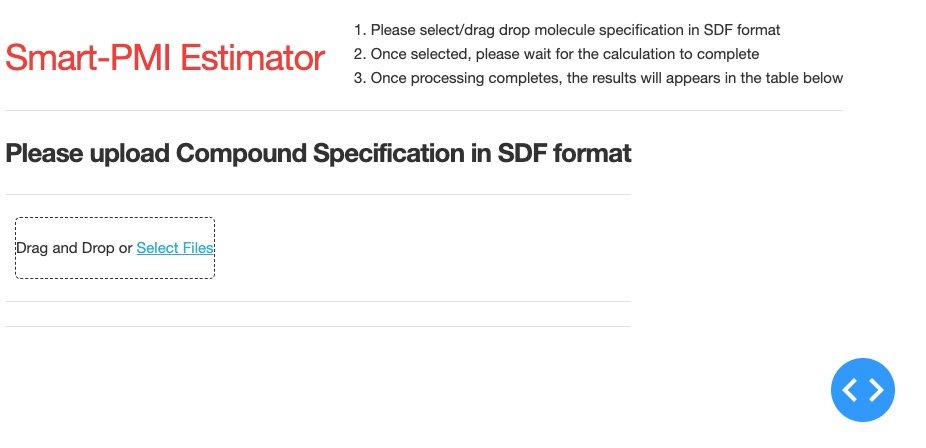

Open SMART-PMI App
===============================================================================

-------------------------------------------------------------------------------

The Open SMART-PMI app provides open source modeling of Process Mass Intensity to scientists. This package contains the model, applications, and the training data used for the Open SMART-PMI project.

This repository supports the following workflows:

* Standalone app: estimating the PMI of a molecule given data in a SDF or SMILES string format

* Commandline interface: rapid re-training and changes in prediction


-------------------------------------------------------------------------------

Table of Contents
-----------------

1. [Overview][#1]

   1.1. [Package Contents][#1.1]

   1.2. [License][#1.2]

   1.3. [Known Issues][#1.3]

2. [Web App Usage Instructions][#2]

3. [CLI Usage Instructions][#3]

4. [Build Instructions][#4]

   4.1. [Setting Up a Build Environment][#4.1]

   4.2. [Building the App][#4.2]


-------------------------------------------------------------------------------


## 1. Overview

The application of green chemistry is critical for cultivating environmental responsibility and sustainable practices in pharmaceutical manufacturing. Process Mass Intensity (PMI) is a key metric which quantifies the resource efficiency of a manufacturing process, but determining what constitutes a successful PMI of a specific molecule is challenging. A recent approach utilized the inherent complexity of the molecule to determine PMI targets from the chemical structure alone. While recent machine learning tools show promise in predicting molecular complexity, a more extensive application could significantly optimize manufacturing processes. To this end, we refine and expand upon the SMART-PMI tool by Sheridan et al. to create an open-source model and application. Our solution emphasizes explainability and parsimony to facilitate a nuanced understanding of prediction and ensure informed decision-making. The resulting model uses only two 0D and two 2D topological descriptors to compute molecular complexity. We develop a corresponding user-friendly app that takes in structured data files (SDF) files to rapidly quantify molecular complexity and provide a PMI target that can be used to drive process development activities. By integrating machine learning explainability and open-source accessibility, we provide flexible tools to advance the field of green chemistry and sustainable pharmaceutical manufacturing.


### 1.1. Package Contents

```
├── README.md          <- this file
├── LICENSE            <- package license
├── data/              <- saved data (supplementary data from Merck)
├── models/            <- saved models
├── src/               <- package source code and programs
├── pyproject.toml     <- Python project metadata file
└── poetry.lock        <- Poetry lockfile
```


### 1.2. License

The contents of this package are covered under the MIT License (included
in the `LICENSE` file).


### 1.3. Known Issues

There are currently no known issues for the package.

-------------------------------------------------------------------------------

## 2. Web App Usage Instructions

The web application is depicted below. Users can upload ChemDraw .SDF files and generate rapid predictions about
the respective molecular complexity and SMART-PMI. The predictive model, GS-04, is further detailed in the paper.

One or more molecules (in ChemDraw .SDF files) can be uploaded for analysis.
The application must be installed locally and is stateless to ensure data privacy. Installation can be done through the 
command line [Section 4] or via Docker. The latter is recommended for those with limited programming experience.

 

-------------------------------------------------------------------------------

## 3. CLI Usage Instructions

The command line interface can be used for rapid experimentation of the models. The `train` command 
takes in an `input` path pointing to the molecule source and will write the model and associated variables to the `output` directory.

   ```shell
    $ python src/main.py train --input <path_to_data> --output_dir <path_to_directory> 
   ```

The following are accepted file formats as `input`:
* directory of SDF files
* file containing SMILES strings (csv, excel)
* a stored dataframe containing SMILES strings (.pkl, .obj)

The `predict` command takes in similar inputs, and also includes an optional specification of the `model` to use. If left blank, 
the four-feature model described in the paper (GS-04) is used as default. 

   ```shell
    $ python src/main.py predict --input <path_to_data> --output_dir <path_to_directory> --model <path_to_model>
   ```

For more help and options, run 

   ```shell
   $ python src/main.py --help
   ```


-------------------------------------------------------------------------------


## 4. Build Instructions
Command line instructions for setting up the environment to run the package or the web app.


### 4.1. Setting Up a Build Environment

<strong><em>Note</em></strong>: this project uses `poetry` to manage Python
package dependencies.

1. <strong><em>Prerequisites</strong></em>

   * Install [Git][git].
   
     May require prerequisite installations, such as [Brew][brew] for MacOS.

   * Install [Python][python] 3.10 (&le; 3.11). 

     <strong><em>Recommendation</em></strong>: use `pyenv` to configure the
     project to use a specific version of Python.

   * Install [Poetry][poetry] 1.2 (or greater).

   * Clone this repository.


2. Set up a dedicated virtual environment for the project. Any of the common
   virtual environment options (e.g., `venv`, `direnv`, `conda`) should work.
   Below are instructions for setting up a `poetry` environment.

   <strong><em>Note</em></strong>: to avoid conflicts between virtual
   environments, only one method should be used to manage the virtual
   environment.

   * <strong>`poetry` Environment</strong>. <em>Note</em>: `poetry` only
     manages the Python environment (it does not manage the shell environment).

     * Create a `poetry` environment that uses a specific Python executable.
       For instance, if `python3` is on your `PATH`, the following command
       creates (or activates if it already exists) a Python virtual environment
       that uses `python3`.

       ```shell
       $ poetry env use python3
       ```

     * Configure a virtual environment just for the project.

       ```shell
       $ poetry config virtualenvs.in-project true
       ```

       For commands to use other Python executables for the virtual environment,
       see the [Poetry Quick Reference][poetry-quick-reference].


3. Once the repository has been cloned locally, navigate inside working directory 
and install the Python package dependencies.

   ```shell
   $ cd PROJECT-ROOT-DIR     <--(e.g.  .../OpenSMART-PMI)
   $ poetry install
   ```

### 4.2. Using the Apps

1. Launching the web application from the command line. 

   ```shell
   $ cd src
   $ python -m webapp.index
   ```

   Navigate to the link described in the terminal.
      For example: `Dash is running on` `http://0.0.0.0:8050/`

   For more details on usage, refer to Section 2.

2. For model experimentation via the CLI, refer to Section 3.

-------------------------------------------------------------------------------

[----------------------------- INTERNAL LINKS -----------------------------]: #

[#1]: #1-overview
[#1.1]: #11-package-contents
[#1.2]: #12-license
[#1.3]: #13-known-issues

[#2.]: #2-web-app-usage-instructions

[#3.]: #3-cli-usage-instructions

[#4.]: #4-build-instructions
[#4.1]: #41-setting-up-a-build-environment
[#4.2]: #42-building-the-app
[#2.3]: #23-installing-the-app


[---------------------------- REPOSITORY LINKS ----------------------------]: #

[poetry-quick-reference]: extras/references/Poetry-Quick-Reference.md

[----------------------------- EXTERNAL LINKS -----------------------------]: #

[git]: https://git-scm.com/

[brew]: https://brew.sh/ 

[python]: https://www.python.org/

[poetry]: https://python-poetry.org/
